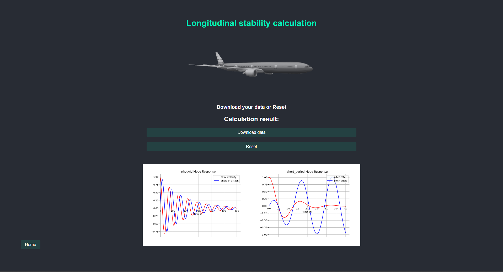

<h1 align="center"><strong><i>AS APP</i></strong></h1>
<h3 align="center">A tool for aircraft stability calculation</h3>

    

---

[![Issues][issues-shield]][issues-url]

### Branches

- [x] [stable] - Stable branch
- [x] [feature/lateral-calculation] - feature branch for lateral calculation

### Purpose
The purpose of this project is to create a tool for aircraft stability calculation. 
The tool will be able to calculate the longitudinal and lateral derivatives of an aircraft as well
as different related parameters such as the damping ratio, the natural frequency etc.

### How to run

> Steps to run the app
- Clone the repository
- Open a terminal in the APP/as folder
- Run `npm install`
- Run `npm run build` then the app should be created and will open automatically.
- Run `electron .` to run the app if closed.

> Steps to run the API
- Open a terminal in the api/ folder
- Run `npm install`
- Run `node .\as-api.js` to run the API

### How to use

- Select the axis you want to calculate: longitudinal or lateral
- Select the json according to the templates given in the templates/ folder:
  - geometricData folder contain:
    - geometricData.json : contains the geometric data of the aircraft
  - longitudinal.json:
    - longitudinalSD.json : contains the longitudinal derivatives' parameter.
    - flightConditions.json : contains the flight conditions for the longitudinal mode.
  - lateral.json:
    - lateralSD.json : contains the lateral derivatives' parameter.
    - flightConditions.json : contains the flight conditions for the lateral mode.
- Click on the calculate button
- The results can be downloaded by clicking on the download button
- Graphs will be displayed directly in the app

PS: All numerical values must be float numbers. (5.0 instead of 5 for example).

### Dependencies problems
- If you have problems with dependencies, try to update using `ncu -u` and then `npm install`
- Try to delete the `package-lock.json` file and then `npm install`
- If you have problems with electron, try to delete the `node_modules` folder and then `npm install`
- If errors persist, open an issue.

### Port issues
- In case you have a port already in use you can change it a .env file in the API folder and add a **PORT** variable to change the port.
- In case you started the app and you want to change the port, you can kill the process using `npx kill-port <number of port>` and then start the app again.

### Acknowledgement
> Supervised by Prof. Yazigi (Professor at IPSA teaching aeronautics)
> 
> Project link: https://github.com/PhantHive/aircraft-stability/

<!-- MARKDOWN LINKS & IMAGES -->
[issues-shield]: https://img.shields.io/github/issues/PhantHive/aircraft-stability.svg?style=for-the-badge&logo=github
[issues-url]: https://github.com/PhantHive/aircraft-stability/issues/