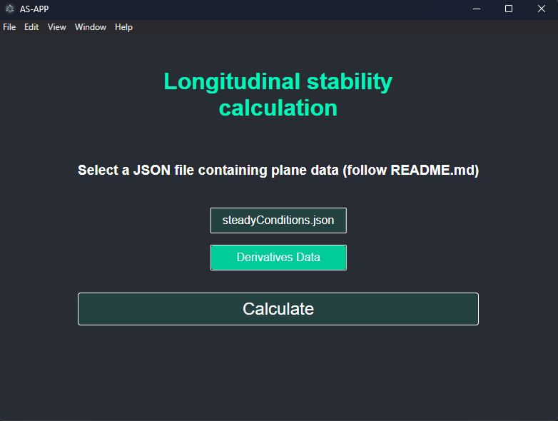

<h1 align="center"><strong><i>AS APP</i></strong></h1>
<h3 align="center">A tool for aircraft stability calculation</h3>

---

[![Issues][issues-shield]][issues-url]

### Branches

- [x] [stable] - Stable branch (complete with start.sh)

### Purpose

...

### How to run

- Clone the repository
- Install dependencies with `npm install`

### Dependencies problems
- If you have problems with dependencies, try to update using `ncu -u` and then `npm install`
- Try to delete the `package-lock.json` file and then `npm install`

### Port issues
- In case you have a port already in use you can change it a .env file in the API folder and add a **PORT** variable to change the port.
- In case you started the app and you want to change the port, you can kill the process using `npx kill-port <number of port>` and then start the app again.

### Acknowledgement

<!-- MARKDOWN LINKS & IMAGES -->
[issues-shield]: https://img.shields.io/github/issues/PhantHive/aicraft-stability.svg?style=for-the-badge&logo=github
[issues-url]: https://github.com/PhantHive/aicraft-stability/issues/